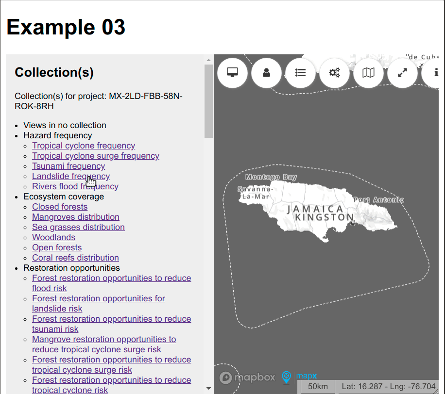

# Example 3

Group project's views by collections in the "host page" and toggle open/close in the "guest mapx application".



```js
const mapx = new mxsdk.Manager({
  container: document.getElementById('mapx'),
  url: 'http://dev.mapx.localhost:8880/?project=MX-2LD-FBB-58N-ROK-8RH&language=en',
});

mapx.on('ready', () => {

  /**
   * Hide views panel
   */
  mapx.ask('set_panel_left_visibility', {
    panel: 'views',
    show: false,
  });

  /**
   * Display current project name
   */
  mapx.ask('get_project').then((s) => {
    $('#project').text(s);
  });

  /**
   * Build toggle buttons for each collections found
   */
  mapx.ask('get_project_collections').then((collections) => {
    const $ = jQuery;
    var $ul = $('<ul>');
    var no_collection_name = 'Views in no collection';
    collections.unshift(no_collection_name);
    collections.forEach((collection) => {
      $('<li>')
        .attr('data-collection', collection)
        .append($('<span>').text(collection), $('<ul>'))
        .appendTo($ul);
    });
    mapx.ask('get_views').then((views) => {
      views.forEach((view) => {
          var view_collections = [];
          if ('collections' in view.data && Array.isArray(view.data.collections)) {
            view_collections = view.data.collections;
          }
          else {
            view_collections.push(no_collection_name);
          }
          view_collections.forEach((view_collection) => {
            var $a = $('<a href="#">')
              .html(view.data.title.en)
              .click(view, function(e) {
                e.preventDefault();
                var $this = $(this);
                var view = e.data;
                $this.toggleClass('active');
                var op = $this.hasClass('active') ? 'view_add' : 'view_remove';
                mapx.ask(op, {
                  idView: view.id
                })
              });
            $ul.find(`li[data-collection="${view_collection}"] ul`).append($('<li>').append($a));
          });
      });
    });
    $ul.appendTo($('#actions'));
  });
});
```


