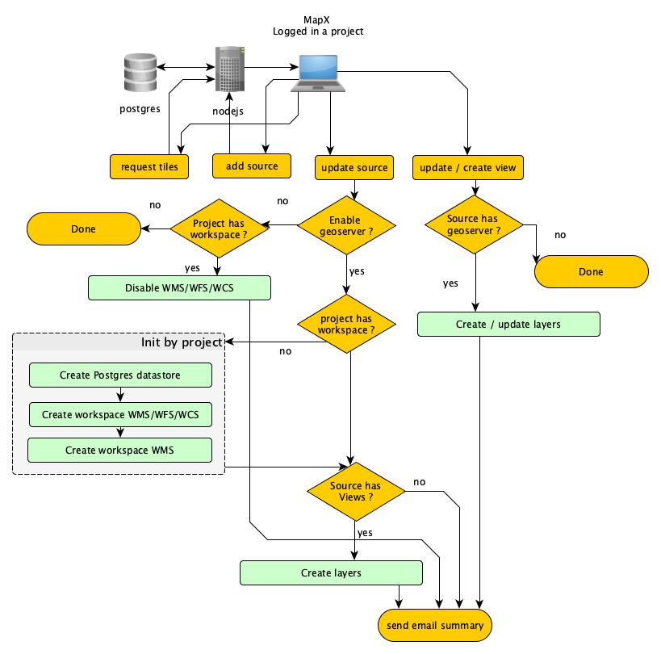

---
title: "MapX - GeoServer"
author: [frederic.moser@unepgrid.ch]
date: "2022-01-25"
keywords: [geoserver, mapx, workspace, datastore, layers, isolation]
...

This document should clarify the role of `GeoServer` within `MapX` services stack. 

### Definitions of `MapX` objects 

- `project` : an ensemble of `sources`, `views`, users, extent and various configurations. A `project` can include very sensitive information that should never be accessible to the public or other services. 
- `source` : an object that represents source data. It can be used as source from a `MapX` `views` or related tools, such as dashboards or custom code. It's referenced in a table `mx_sources` in `MapX` `PostgreSQL` database. It contains associated metadata derived from `ISO_19115`, with some custom fields and multilingual support. A `source` of type `vector` is linked to a geospatial layer stored in `PostGIS`, typically uploaded through `MapX` GUI or API. Each source is limited to a single `project`. It's isolated from other `projects`.
- `view` : an abstract object that displays something in `MapX` : raster or vector layers, styling rules, graphics, dashboards, abstract, story map. It's the base document in `MapX`. Can be shared between project. `Views` hold rights about who can read or edit its content. A `view` of type `vt` – vector tiles – can request PBF tiles extracted from `PostGIS` via `NodeJS`, using data from the vector `source` layer. A `view` of type `rt` – raster tiles – can request external tiles or data from `WMS/WMTS` requests, currently not provided by `MapX`.

### `GeoServer` role in `MapX` 

`MapX` works with its own internal tools to store and publish its data. `PostgreSQL` is used extensively : fast, reliable, flexible.

Until 2017, `R` was used as the main server side language. `MapX` was originally a tool oriented towards spatial analytics and statistics. Today, all blocking processes have been ported to `NodeJS`, except interactions with `GeoServer`. Significant delays regarding the catalog update have been discovered late in the integration. The workaround implemented was to write a script that launch blocking operations in another thread and reports success or issues by email.
 
`GeoServer` was, of course, one of the first tools to be evaluated as spatial backend, but since the beginning, one of the main requirements was to be transferred very small amount of data at runtime and enable the client's computer to do the rendering and some analysis. Dynamic time sliders without server round trip, web worker cache, data searchable / filterable client side, support for low bandwidth, etc. So we opt-in vector tiles very early in the process. `GeoServer` vector tiles rendering was an order of magnitude slower than the tool we used at that time. We built our own process later to gain flexibility, `Redis` based cache management and general performance improvement.

In 2018, the support for WMS/WFS and other standards requirement was pushed forward. Not as the main way of distributing content, but as a way to enable other tools and platforms to interact with `MapX`. `GeoServer` has been added to our stack, with a limitation: not all data should be available via WMS or WMS/WFS. Some data should not be listed or readable to anyone except from a few people in `MapX` private projects.

So, for interactions with `GeoServer`, the strategy was to build an architecture that reflects the isolation provided by `MapX`, and allow cherry picking some sources to be available as a layer in `GeoServer`, using `views` as configuration. It has been decided to create two workspaces for each project, one for "WMS", the second for "WMS/WFC/WCF", each of them linked to a datastore. Layers from `MapX` `sources` could then be published in one or two workspaces, depending on the source restriction, using the `views`' title, abstract and style. The style not yet fully supported, but a conversion library `MapX` to `SLD` is on its way.

### Summary 

- The `GeoServer` endpoint is only used to enable partial interaction with `MapX` data from third party tools.
- 1 `project` = 2 workspace to enable isolation /  settings defined at the `project` level and `source` level. Subsequently, 1 `PostgreSQL` datastore per workspace.
- 1 `view` = 1 layer in one of the two workspaces, if the source requests it.
- An update on a `source` configuration in `MapX` triggers an update on all dependents `GeoServer` layers, if required.
- An update on a `view` triggers a single layer update in `GeoServer`, if required.
- No interaction with geoserver in both `views` and `source` update, if "WMS" or "WMS/WFS" option are not enabled in `source` configuration.

The figure 1 shows a simplified overview of the workflow used to update `GeoServer` catalog from `MapX`.

