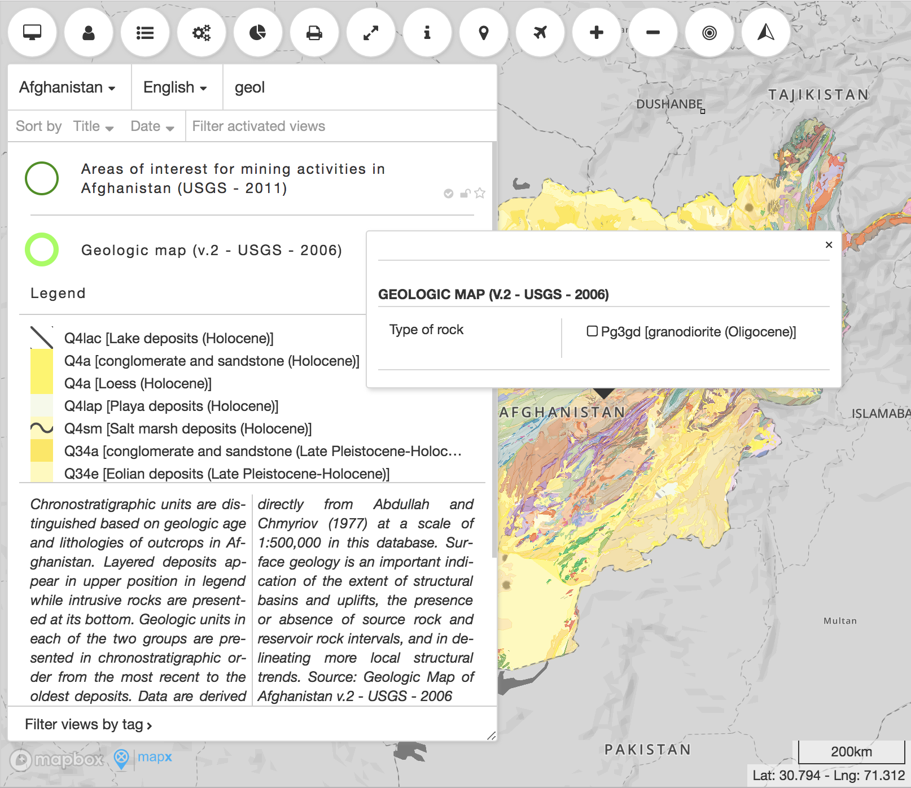

# [MapX](https://www.mapx.org/)

[MapX](https://www.mapx.org/) is a spatial data infrastructure that aims to support the sustainable use of natural resources and the environment by increasing access to the best available geospatial information and related monitoring technologies. MapX is supported by an online platform that provides authoritative spatial data at local, national and global scales, an authentication data integrity framework using a scorecard and a set of on-line tools to visualize, analyse and access geospatial data. Originally created for stakeholders involved in the extractives sector, MapX has expanded in 2017 to other fields where spatial data can help inform stakeholder dialogue, prioritization of investments and impact monitoring such as disaster risk reduction, chemicals management, biodiversity planning, renewable energy and environmental security.



# Development environment

The included `docker-compose.yml` allows to setup a development environment.

Trigger the following script which init some required directories and copy the default environment variable to './mapx.dev.env' (if missing):
```
$ ./docker-compose.init.sh
```

Finally launch the mapx stack:
```
$ docker-compose pull
$ docker-compose up
```

The application should be available at http://app.mapx.localhost:8880/ (curl -H Host:app.mapx.localhost http://127.0.0.1:8880/).

An admin user is available as `admin@localhost` which can be used to login; get the password by browsing the web mail at http://mail.mapx.localhost:8880/.

## Known issues

Postgis : `OperationalError: could not access file "$libdir/postgis-X.X` : solution, run `docker-compose exec pg update-postgis.sh`
 
## Development session for `app` service

```
$ docker-compose up -d
$ docker-compose exec app sh
$ cd /srv/shiny-server/dev/
$ R
$ source("run.R")
```

Then an instance of mapx should be available at http://dev.mapx.localhost:8880/ for which the source code from `./app/` is mounted as `/srv/shiny-server/dev/` in the container.

## Development session for `api` service

Update your `mapx.dev.env` file as follow:
```
...
# API_PORT=3030
# API_HOST_PUBLIC=api.mapx.localhost
API_PORT=3333
API_HOST_PUBLIC=apidev.mapx.localhost
...
```

The start the expressjs development server:
```
$ docker-compose up -d
$ docker-compose exec api sh
$ cd /apidev
$ node inspect index.js port=3333
...
debug> c
< listen to 3333
...
```

The instance now should use the api service at http://apidev.mapx.localhos:8880/ for which the source from `./api/` is mounted as `/apidev/` in the container.

Note that you might need to add the different hosts `*.mapx.localhost` to your system hosts file.

### `api` tests
Run tests within the development container:
```
$ docker-compose exec api sh
$ cd /apidev
$ npm run
```
